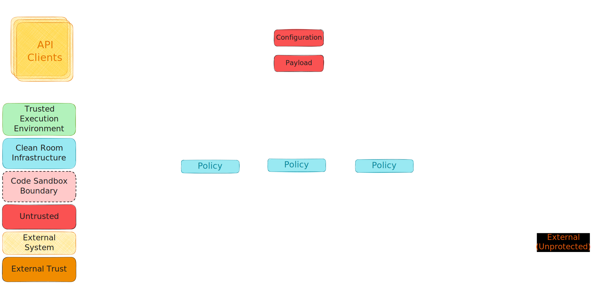
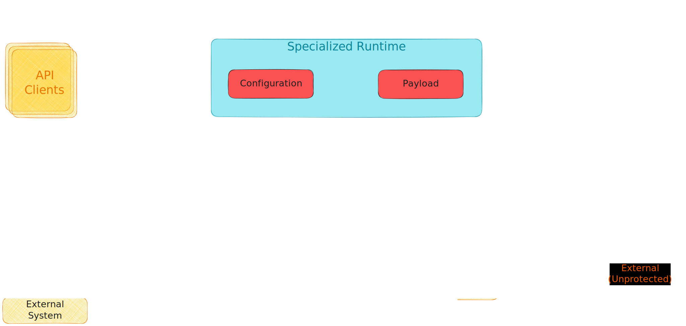

# Architectural Overview
<!--
  This section captures the overall architecture of a Clean Room.
-->

A Clean Room is a verifiable computation construct to process sensitive data. It hosts customer
applications requiring data protection within a standardized privacy preserving infrastructure.
The infrastructure takes on the responsibility of ensuring that the customers’ data is not
accessible outside the confidential TEE while treating the customers’ application as
opaque/untrusted code and executes the same within a sandbox enforcing the desired protection.

## Canonical Architecture

Figure - _Canonical representation of a Clean Room_

A canonical Clean Room provides a built-in mechanism for:

- executing opaque/untrusted code within a “code sandbox”,
- ensuring any data flowing out of this sandbox flows through a “data protection firewall”
  preventing any exfiltration.

### Code Sandbox

The code sandbox provides an isolation boundary between the customer application and the Clean Room
infrastructure, preventing any potentially faulty/malicious code from performing unauthorized
operations or IO.

### Data Protection Firewall

The data protection firewall is responsible for securely accessing sensitive data from the backing
data stores.

This functionality is provided to the customers’ application by surfacing hardened endpoints for
accessing the data securely. The mechanism used by such an endpoint to secure the data will depend
upon the _structure of the data_ being secured, and the _application layer protocol_ being used to
send this data to the backing data store.

E.g., if the application is consuming a data store as a block device, the corresponding data source
endpoint can surface the data directly as a raw volume mapped into the sandbox and decrypt/encrypt
at a block level.

On the other hand, if the application is consuming a data store as a file container,
the corresponding data source endpoint can surface the backing file container as a local volume
mapped into the sandbox, and the items within the file container as files that are
decrypted/encrypted at a file level.

Similarly, if the application is consuming a data store as a relational database, the corresponding
data source endpoint can surface a local proxy into the sandbox that executes user specified
queries to enforce egress rules at a row/column level.

Given the diverse and ever-expanding range of data stores, structure of the data being stored on
these data stores and the underlying protocols used for communication, a standardized access
mechanism would be difficult to achieve and sustain. Instead, an extensible architecture is
required for developing such mechanisms and plugging them into the data protection firewall,
allowing the applications to communicate with the endpoints directly in the native protocol for the
data source.

To achieve this, the data protection firewall is modelled using a collection of data source specific
extensions called privacy proxies, that extend the infrastructure to provide the desired
functionality.

The infrastructure natively provides hooks for surfacing local volumes into the sandbox, and this
can be used by extensions modelling data source as block devices or as a container of items. All
other models for consuming data will come through the network and are surfaced into the sandbox as
a network port.

### Privacy Proxy

Privacy proxies’ surface hardened endpoints for the backing data store inside the Clean Room.

From an application perspective, the proxy abstracts away nuances of confidential computing such as
privacy policy, client-side encryption and secure key release protocols. This allows the customer
application executing within the code-sandbox to remain agnostic to the privacy firewall and
communicate transparently with the backing datastore while accessing the data in clear.

From a data protection perspective, the proxies protect against data exfiltration by enforcing data
source protocol specific protection policy at the application layer. This protection comes in the
following flavours:

- A “secure” mode that encrypts all outbound data with a key that is only available inside a
  Clean Room environment. This mode effectively locks the data to a “closed loop” confidential
  network where any application consuming the data is also required to be executed within an
  environment that meets the secure key release policy requirements. Enforcing confidential
  computation requirements as part of the key release policy ensures that even if malicious actors
  obtain access to the data store, they will not be able to decrypt and consume the actual data
- A “trusted” mode that encrypts all outbound data with a mechanism enforcing customer specified
  external trust. This trust could come in multiple forms – TLS encrypted channel (HTTPS) with a
  trusted endpoint, or client-side encryption using a public key for which private key is securely
  accessed by other means, to state a couple. This mode enables a “trusted loop” network where
  customer applications running in a Clean Room can interoperate with applications executing in
  alternative trusted environments such as on-premises locations.
- A “open” mode that inspects all outbound data (responses/outbound calls) and enforces egress
  rules governing the type/content of data that is allowed to go out of the Clean Room. This enables
  customer applications operating as a gateway for sanitized data to interface with a zero-trust
  “open loop” partner/external network.

## Security Considerations

The nature of data protection offered by a Clean Room is a function of the security considerations
of the mechanism used to enforce the code sandbox.

### Sandbox Models

Clean Room implementations can be based on two types of sandboxes:

#### APPLICATION SANDBOX

In an Application Sandbox, the customer application and the Clean Room infrastructure execute within the same operating system and share the same kernel.

#### OPERATING SYSTEM SANDBOX

In an operating system sandbox, the customer application and the Clean Room infrastructure are executed in separate operating systems and kernels.

### Isolation Technologies

The Clean Room sandbox creates and enforces an isolation boundary between the lower privileged customer application and higher privileged Clean Room infrastructure code.

Multiple hardware and software isolation technologies can be used to achieve this isolation and prevent the application code from gaining higher privileges and tampering with the infrastructure to bypass the firewall.

#### PROCESS ISOLATION

Sandbox implementations create an isolation boundary between the customer application and Clean Room infrastructure using process privileges, leveraging OS primitives for virtual address space isolation and kernel security configuration to protect higher privileged infrastructure code from the lower privileged application code.

#### VM ISOLATION

Sandbox implementations create an isolation boundary between the customer application and Clean Room infrastructure by deploying them on two different Virtual Machines - a “Firewall” VM executing the infrastructure code and a “Sandbox” VM executing the customer application, where the lower privileged "Sandbox” VM is locked down and can only communicate with the higher privileged “Firewall” VM.

#### VMPL ISOLATION

AMD introduced Virtual Machine Privilege Levels in the [SEV-SNP](https://www.amd.com/content/dam/amd/en/documents/epyc-business-docs/white-papers/SEV-SNP-strengthening-vm-isolation-with-integrity-protection-and-more.pdf) architecture that allows a VM address space to be subdivided into four hardware-isolated levels and enables the VM to provide additional security controls. This allows code running at a higher privilege level to control which memory pages are accessible to code executing at a lower privilege level, as well as the operations (R/W/X) allowed on such pages.

Sandbox implementations create an isolation boundary between the customer application and Clean Room infrastructure using VMPLs (and the equivalent TD partitions from Intel), executing the infrastructure code at a higher privilege (VMPL0) to protect it from the customer application executing at a lower privilege (VMPL3).

## Types of a Clean Room

There are multiple options for creating a Clean Room.
The following options are based on an application sandbox model:

- A Type 0 Clean Room realizes an application sandbox using process isolation.
- A Type 1 Clean Room realizes an application sandbox using a combination of VMPL and process isolation, augmenting kernel security configuration through a “proxy” kernel executing the customer application at a lower privileged VMPL.

The following options are based on an operating system sandbox model:

- A Type 2 Clean Room realizes an operating system sandbox using VMPL isolation to carve out a “nested” VM, hosting an inner lower privileged “Sandbox” VM executing the customer application within the outer higher privileged “Firewall” VM executing the infrastructure code.
- A Type 3 Clean Room realizes an operating system sandbox using a combination of VMPL and VM isolation, executing the customer application at a lower privileged VMPL in a  “Sandbox” VM and executing the infrastructure code at a lower privileged VMPL in another “Firewall” VM. Custom “firmware” executing at a higher privileged VMPL in both VMs ensures that all communication originating from the “Sandbox” VM terminates in the “Firewall” VM.

## Specialization of a Clean Room

The canonical architecture lends itself readily to scenarios that can be realized through Clean Rooms hosting privacy proxies in “secure” mode or “trusted” mode. Operating proxies in “open” mode requires the customer to define an egress policy that can be consumed by a policy engine to programmatically inspect the content of the data, and reliably assert that any sensitive data is not accidentally/maliciously included in the output.

This can be a challenge in general, as coming up with such a policy is not straightforward and might not even be feasible in scenarios where the output is binary/encoded.

One mechanism for “open” mode scenarios is to model such egress policies behind a new proxy that surfaces a specialized format aware endpoint to the application. The proxy implementation backing the endpoint interprets and sanitizes the data being stored in a format and scenario specific manner, before allowing egress from the Clean Room to a more generic data store.

E.g., if the sink for an ML training application is directly modelled as a blob in an Azure Blob Storage container, it is not feasible for the blob container proxy to enforce specific egress rules to ensure that the contents of the byte stream being output is actually an ML model and not arbitrary data. On the other hand, if the sink is modelled as a virtual store for say ONNX format files, the proxy can internally load the content using ML tooling to ensure it is a well-formed ONNX compatible model before writing it out as generic binary content to the backing data store. This will provide a basic degree of protection against malicious code inside the sandbox leaking arbitrary data through a binary byte stream. This proxy could further enforce a rule engine that could state say the set of allowed ONNX operators as part of the validation.

Having said that, modeling such a specialized data store might not always be a viable proposition. In such cases, given rules cannot be enforced on the data flowing through the data firewall, it follows that rules need to be enforced on the application binary executing within the code sandbox.

Such rules are typically enforced through binary runtimes that restrict the capabilities available to the application modules, usually through their own SDK/API model. However, a generic binary runtime enforcing “rules” on the application module is not a useful construct for the “Clean Room” customers. Not only would it need to address requirements catering to a wide and ever-expanding set of domains/scenarios, but it would also require customers to rebuild/retrain their development teams to a new methodology, breaking the original “Clean Room” value proposition.

A more pragmatic/useful approach for “open” mode scenarios is an ability to extend trust-based rules to the application executing within the Clean Room. Such a mechanism can be used by customers to either, trust the application as a whole (in house/reliable development process), or leverage an existing layer/platform as a “trusted” runtime hosting an untrusted payload (outsourced/unreliable development process).

### Custom Runtime

Figure - _Clean Room with custom runtime_

The most straightforward trust-based rule for application code would be enforcement of a customer specified digital signature for the executable being launched inside the sandbox. This externally trusted executable is treated as a “custom runtime” by the Clean Room infrastructure, which provides the necessary support for optionally passing in per instance opaque/untrusted configuration and payload as injected resources.

Separation of trust and privacy level between the hosting executable and the configuration/payload makes it simpler for customers to separate their application into domain/scenario driven “standard” runtime and customer specific modules. While this reduces the developer burden for all customers, it is particularly helpful for collaboration scenarios where it is easier for multiple collaborators to agree upon a transparent standard executable/binary runtime hosting per collaborator secrets.

For example, ad-tech domain collaborators with a strong industry direction on WASM could agree on using an executable originating from the `wasmtime` repository as the “trusted” custom runtime hosting untrusted WASM modules. The infrastructure can then be configured such that each of their proprietary WASM modules is directly released into the Clean Room with confidential computation protection and presented as a payload for this “custom runtime”.

Similarly, customers collaborating for ML model training could agree upon using an executable originating from the Pytorch repository as the “trusted” custom runtime training proprietary ML models on sensitive data sets. The infrastructure can then be configured such that the protected models and associated configuration as well as protected data sets are directly released into the Clean Room with confidential computation protection and presented as configuration/payload for this “custom runtime”.

### Specialized Runtime

Figure - _Clean Room with specialized runtime_

For verticals/domains with large customer demand for data processing, it is likely that Microsoft /ISV partners have existing solutions to create simplified workflows enhancing customer experience.

Executing such workflows within a Clean Room enables a potentially expedient path for the 1P/3P solution to offer robust data protection guarantees to their customers and enable zero-trust collaboration as well. While these workflows can in principle be implemented using a canonical Clean Room, it is likely that such workflows are already using a mechanism of having a “trusted” binary footprint process a well-formed customer input. Given this, specializing the Clean Room by leveraging this “trusted” binary footprint as a “custom runtime” processing customer input as an untrusted configuration/payload, might enable a relatively low-cost path for 1P/3P solutions to provide value to their customers.

For solutions with a very strong demand for data protection guarantees, it might be beneficial to eventually promote the “trusted” runtime out of the code sandbox and data protection firewall, and into the Clean Room infrastructure as a “specialized runtime”. Apart from the performance benefits of reduced hops, this allows the runtime more flexibility in external communications.

## Governance of a Clean Room

Clean Room infrastructure natively provides extensibility hooks for invocation of user specified external service endpoints (trusted) to enable governance flows like runtime validation of consent for executing the application or presenting data, generation of an audit trail for all privileged operations performed inside the clean room, and confidential telemetry for any troubleshooting.
