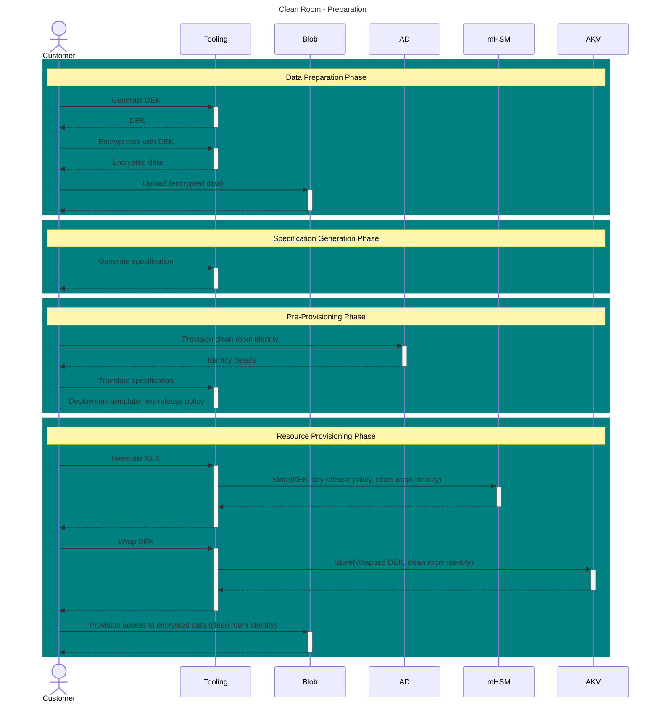
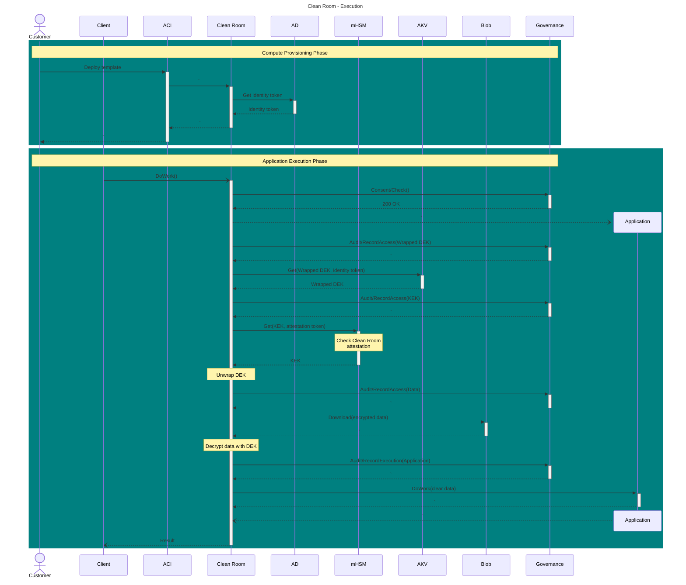

# User Flow
<!--
    This section provides an overview of end-to-end customer flows leveraging a clean room for processing sensitive data in the public cloud.
    Audience: Engineering & PM
    Prerequisites: Architectural Overview
-->

## Canonical Workflow

The workflow for storing sensitive data in the public cloud and consuming it from an application executing within a Clean Room involves multiple phases.

### Preparation Stage

#### DATA PREPARATION PHASE
In this phase, customers secure the data to be processed inside the clean room. Typical considerations for this phase include evaluation of storage requirements for the encrypted data, mechanisms for protection of the data through encryption, and mechanisms for secure storage of the encryption key.
#### SPECIFICATION GENERATION PHASE
In this phase, customers author specification of clean room(s) that should have access to the secured data. Typical considerations for this phase include evaluation of the security requirements (type of the clean room), evaluation of the privacy protection requirements (proxy mode and configuration), and evaluation of the deployment model (monolithic vs distributed).
#### PRE-PROVISIONING PHASE
In this phase, customers provision artefacts for deploying a clean room. Typical considerations for this phase include mechanisms for translating the clean room specification into a deployment template for the trusted computation environment, and mechanisms for associating an attestable identity with this environment to facilitate secure access to protected resources.
#### RESOURCE PROVISIONING PHASE
In this phase, customers configure secure access from the computation environment to their data. Typical considerations for this phase include mechanisms for enabling role-based access to resources from the clean room identity and verifying the clean room attestation before releasing encryption keys from secure storage.

### Execution Stage
#### COMPUTE PROVISIONING PHASE
In this phase, customers deploy clean rooms by rolling out the deployment templates generated above. Typical considerations for this phase include configuration of compute (SKU, networking) and configuration of mechanisms to manage, scale and orchestrate the application/instances.
#### APPLICATION EXECUTION PHASE
In this phase, the customer triggers the application code. Typical considerations for this phase include mechanisms for protection against exfiltration.

### Sample Workflow

Figure *Sample workflow using Azure Clean Room (preparation stage)*

Figure *Sample workflow using Azure Clean Room (execution stage)*

## Collaboration Workflow

As discussed earlier (“Collaboration”), the Clean Room application architecture enables a zero trust multi-party collaboration workflow where secret data originating from one or more parties (data providers) is presented to opaque code originating from another party (code provider) in a safe computation environment hosted by a different party (solution provider), with the assurance that all the secret data will only be used within this computation and cannot be copied, accessed or misused outside this environment.
Collaboration workflows build upon the Canonical Workflow described earlier and involve similar phases, with additional coordination/agreement requirements across more than one party at every step.
### Preparation Stage
#### DATA PREPARATION PHASE
In this phase, data providers secure the data for collaboration, and it is executed concurrently/independently by each collaborator. Considerations for this phase are the same as those for the single party Data Preparation Phase.
#### CODE PREPARATION PHASE
In this phase, code providers secure the code for collaboration, and it is executed concurrently/independently by each collaborator. Typical considerations for this phase include evaluation of storage requirements for the encrypted code, mechanisms for protection of the code through encryption, and mechanisms for secure storage of the encryption key.
#### SPECIFICATION GENERATION PHASE
In this phase, a collaboration agreement is reached between all the collaborators. Typical considerations for this phase include mechanisms for generation and acceptance of a collaboration contract represented as a Clean Room specification that captures the security requirements (type of the clean room), privacy protection requirements (proxy mode and configuration) and deployment model (monolithic vs distributed) of the collaboration, and handshake mechanisms to facilitate the same.
#### PRE-PROVISIONING PHASE
In this phase, the solution provider provisions artefacts for deploying the clean room executing the collaboration. Considerations for this phase are the same as those for the single party Pre-Provisioning Phase.
#### RESOURCE PROVISIONING PHASE
In this phase, data & code providers configure secure access from the computation environment to their data/code. An additional consideration for this phase from those for the single party Resource Provisioning Phase includes mechanism for enabling access to resources for a cross tenant clean room identity.

### Execution Stage
#### COMPUTE PROVISIONING PHASE
In this phase, the solution provider deploys clean rooms by rolling out the deployment templates generated above. Considerations for this phase are the same as those for the single party Compute Provisioning Phase.
#### APPLICATION EXECUTION PHASE
In this phase, the solution provider or code provider triggers the collaboration code. Additional considerations for this phase from those for the single party Application Execution Phase include mechanisms for the computation environment to enforce the collaboration contract and secure storage of the output of the computation.
###	Post Execution Stage
#### CONSOLIDATION PHASE
In this phase, the solution provider processes completion signal from the computation environment and informs the collaborators. Typical considerations for this phase include mechanisms for ensuring output can only be accessed by authorized parties.
#### TEARDOWN PHASE
In this phase, the computation environment is torn down by the solution provider.
 
3.2.4.	Sample Workflow

Figure 4 3 Sample collaboration workflow using Azure Clean Room (preparation stage)

Figure 4 4 Sample collaboration workflow using Azure Clean Room (execution stage)
