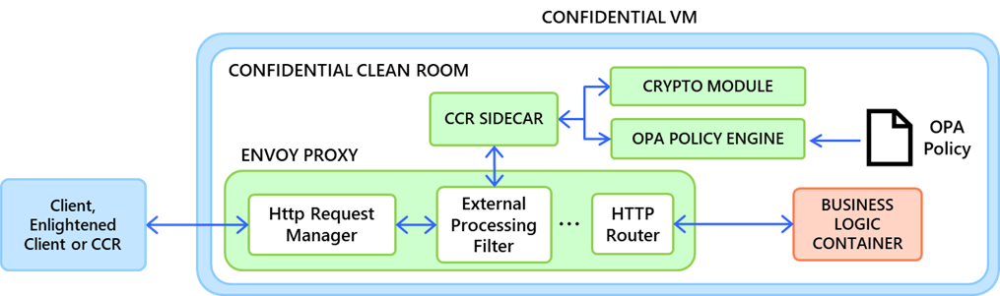

# High Level Design
<!--
This section captures high-level design of Azure Clean Room Infrastructure.
Audience: Engineering
Prerequisites: Architectural Overview
-->
An implementation of a Type 0 Azure Clean Room has been realized on top of Azure Confidential Container Instances (Confidential ACI).

## Overview

The Azure Clean Room implementation builds upon the Microsoft Research (Confidential Clean Room Services for DEPA) proposal to sandbox untrusted code using containers.

### DEPA

Figure *DEPA Confidential Clean Room Architecture (Confidential Clean Room Services for DEPA)*

DEPA Confidential Clean Rooms are a privacy preserving construct providing a secure, isolated execution environment where sensitive information from one or more data providers can be processed with security and privacy guarantees. The containerized reference implementation sets up a HTTP proxy using Envoy to enforce egress rules, and leverages Linux IP tables to achieve a sandbox that ensures all communications from the “untrusted” business logic container are intercepted by this proxy and inspected by a policy engine.

### Canonical Clean Room

Figure *Type 0 Azure Clean Room using Confidential ACI (Canonical)*

- The clean room specification is translated into a Confidential ACI container group specification, consisting of a set of infrastructure containers (sidecars) executing audited/trusted code, and a set of user containers running unaudited/untrusted code.
- The container group is configured such that the infrastructure containers (sidecars) execute with system/root privileges and user containers executed with user/non-root privileges.
- The infrastructure containers (sidecars) leverage constructs from the underlying kernel and container runtime to set up firewall rules and mount points that ensure all IO from the user containers is intercepted by the infrastructure containers.
This implementation of the Clean Room meets the functional requirements well, while providing high levels of flexibility/extensibility in terms of adding support for a large variety of data sources. However, there are concerns about the security of this model and servicing the same.

### Security Considerations

The usage of process isolation as the isolation boundary for the code sandbox makes the system vulnerable to the following chain of events:

1. A user container executing with user/non-root privileges can exploit a bug in the container runtime/kernel and elevate its privilege.
1. Once elevated, the user container can tamper with/circumvent the firewall and perform operations that would otherwise require root privileges.
1. “Elevation of Privilege” bugs within UVM Linux are no longer considered a security incident, and current Cloud security guidelines operate with the VM boundary as the basic block for a security perimeter. So, the complete VM is considered hostile from the perspective of the hypervisor, host OS, other VMs and the rest of the Cloud infrastructure, making any internal attacks within the VM noncritical.

#### SERVICING SECURITY ISSUES

Microsoft is not set up to service Clean Room usage specific issues in the UVM OS on a priority basis:

- “Elevation of Privilege” bugs within a VM are not considered security incidents, so any changes required in the UVM OS code to address any known/newly discovered vulnerabilities would need to come as part of the regular bug fix process.
- Further, these are even likely to be categorized low priority within that process by the rest of the community given the general direction of relegating security guarantees to the VM boundary.

### Engineering Considerations

While there is a clear path to production for Clean Rooms on Confidential ACI, Microsoft cannot make any support statement or provide any security guarantees around the code sandbox due to the security concerns discussed above. This effectively rules out the ability to offer a Canonical Clean Room using process isolation, as customers are now required to establish an external trust in the “untrusted” application that it will not attempt to break out of the sandbox.

### Custom Runtime Clean Room

Instead, a specialized clean room executing a custom runtime is used to enable the subset of customers/scenarios where a “trusted” runtime exists and can explicitly be trusted by the customers to not be malicious.

Figure *Type 0 Azure Clean Room using Confidential ACI (Production)*

While this requirement places a little more burden on customers in comparison to a Canonical Clean Room, it provides value to the customers by retaining almost all the benefits of the clean room infrastructure discussed earlier in the document.

<!-- TODO: Add details about the options for customers to explicitly specify this external trust as part of the clean room specification.  -->

## Code Sandbox
<!-- TODO: Add high level design of the mechanisms used to realize a code sandbox. -->
- Infrastructure – privileged containers, launched using ACI.
- Application – non privileged containers, launched using podman.

## Data Protection Firewall
<!-- TODO: Add high level design of the mechanisms used to ensure interception of all traffic originating from within the sandbox. -->
- Storage – Only secure volumes mounted to application containers
- Network – Iptables firewall configured to drop all external packets

## Privacy Proxy

### Volume
<!-- TODO: Add high level design of the mechanism used to surface a “secure" mode hardened volume as a data source/sink for Azure Blob Storage. -->
- `blobfuse` mounted Azure Storage
- Individual encrypted blobs present to application as clear text files
- Secure key release for encryption key

### API
<!-- TODO: Add high level design of the mechanism used to surface a “open” mode hardened HTTP API endpoint. -->
- Envoy HTTP proxy
- Open Policy Agent engine inspects request-response

## Governance

### Consent
<!-- TODO: Add high level design of the mechanism used for runtime validation of consent for executing the application or presenting data. -->
- Infrastructure code invokes specified external service endpoint (trusted) to check for consent to execute the application and present data to it.
- Governance service responsible for maintaining tamper proof consent, infrastructure code only ensures that invoking the consent endpoint resulted in a valid response (based on specified success codes) before proceeding with the operation.
- Support for multiple consent endpoints.

### Audit
<!-- TODO: Add high level design of the mechanism used to log audit events and generate of an audit trail for all privileged operations performed inside the clean room. -->
- Infrastructure code invokes specified external service endpoint (trusted) to record audit events.
- Governance service responsible for maintaining tamper proof audit ledger, infrastructure code only ensures that invoking the audit endpoint resulted in a response confirming that the audit event has been recorded (based on specified success codes) before proceeding with the operation.
- Support for multiple audit endpoints.

### Telemetry

#### INFRASTRUCTURE
<!-- TODO: Add high level design of the mechanism used to govern and emit telemetry about the infrastructure. -->
- Collect Open Telemetry (OTel) metrics, traces and logs emitted by infrastructure code.
- Infrastructure code invokes specified external service endpoint (trusted) to check for consent to export telemetry events.
- Governance service responsible for maintaining tamper proof consent, infrastructure code only ensures that invoking the consent endpoint resulted in a valid response (based on specified success codes) before exporting the events to the data sink specified in the clean room specification.
- Low data egress risk expected as infrastructure code is audited and trusted, data sink proxy can operate in any mode - secure/trusted/open.
- E.g., encrypted blobs in Azure Storage container.

#### APPLICATION
<!-- TODO: Add high level design of the mechanism used to govern and emit application logs. -->
- Capture console logs emitted by application.
- Infrastructure code invokes specified external service endpoint (trusted) to check for consent to export application logs.
- Governance service responsible for maintaining tamper proof consent, infrastructure code only ensures that invoking the consent endpoint resulted in a valid response (based on specified success codes) before copying captured logs to the data sink specified in the clean room specification.
- High data egress risk as application code is unaudited and untrusted, data sink proxy can only operate in protected modes - secure/trusted.
- E.g., encrypted blobs in Azure Storage container.

## Frequently Asked Questions

### If the Type 0 sandbox expects the “custom runtime” to be trusted, then why bother with a Clean Room at all? Why not just use C-ACI?

A “Clean Room” is a way of configuring confidential computation, not an alternative mechanism. As discussed above in “Translating intent to a confidential computation configuration”, configuring C-ACI to operate as a clean room requires careful configuration and customers have a steep learning curve outside their core business domain. While the security considerations of the Type 0 Azure Clean Room require us to enforce an external trust on code in the sandbox, specifying this trust is a relatively trivial burden for the customer as compared to the rest of configuration.

This holds true for all custom runtime sandbox use cases, Type 0 or otherwise.

### Is a Type 0 Clean Room a placeholder, or long-term offering?

Apart from the advantage of having a clear path to production, a Type 0 Azure Clean Room remains a useful long-term offering as it appears to have a reasonable addressable market and is not just an initial/placeholder v1 offering.

The VMPL and VM isolation models provide a more secure code sandbox, but this security comes at a performance cost as data needs to flow across OS/kernel boundaries/address spaces. Any customer scenario with an externally trusted custom runtime such as single tenant lift and shift applications and 1P integrations are very likely to keep opting for a Type 0 Clean Room to avoid this performance penalty even after the alternative models become available.
