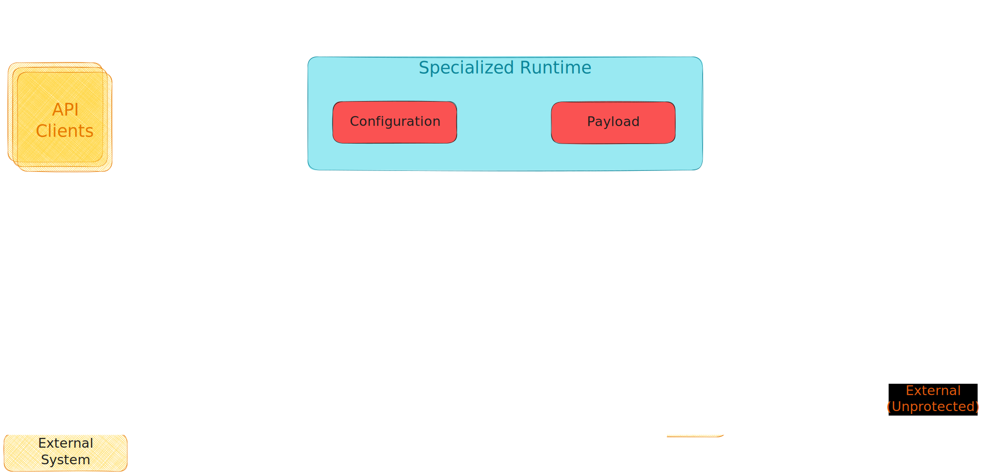

# `excalidraw` drawings

All the images in this directory have been generated using [Excalidraw](https://excalidraw.com/).

## Using a drawing

## Updating a drawing

Follow these steps to update the diagram:

1. Open the *`SVG`* file on [Excalidraw](https://excalidraw.com/), or simply drag it onto their website.
2. Make the necessary changes to the drawing.
3. Export the drawing as an *`SVG`*, making sure you select the **`Embed Scene`** option. Excalidraw embeds the *`JSON`* for the drawing inside the *`SVG`* file.

Courtesy [https://github.com/orgs/community/discussions/12216](https://github.com/orgs/community/discussions/12216#discussioncomment-2319700).
