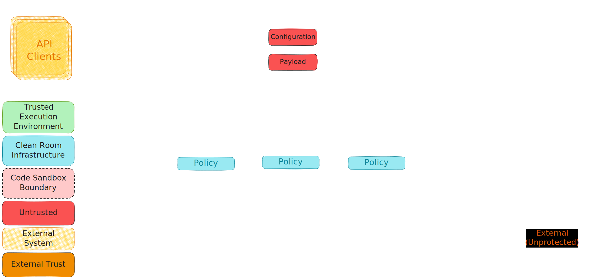

# Architectural Overview
<!--
  This section captures the overall architecture of a Clean Room.
-->
<!--TODO: Add links to all the offerings/technologies mentioned in this file.-->
<!--TODO: Do we want to talk about type 0-4 of clean rooms, or just stick to type 0? -->
<!--TODO: Do we want to talk about canonical, custom and specialized, or just stick to custom? -->

This content has been moved [here](../public/architectural_overview.md).

## Canonical Architecture

This content has been moved [here](../public/architectural_overview.md).

## Security Considerations

The nature of data protection offered by a Clean Room is a function of the security considerations
of the mechanism used to enforce the code sandbox.

### Sandbox Models

Clean Room implementations can be based on two types of sandboxes:

#### APPLICATION SANDBOX

In an Application Sandbox, the customer application and the Clean Room infrastructure execute within the same operating system and share the same kernel.

#### OPERATING SYSTEM SANDBOX

In an operating system sandbox, the customer application and the Clean Room infrastructure are executed in separate operating systems and kernels.

### Isolation Technologies

The Clean Room sandbox creates and enforces an isolation boundary between the lower privileged customer application and higher privileged Clean Room infrastructure code.

Multiple hardware and software isolation technologies can be used to achieve this isolation and prevent the application code from gaining higher privileges and tampering with the infrastructure to bypass the firewall.

#### PROCESS ISOLATION

Sandbox implementations create an isolation boundary between the customer application and Clean Room infrastructure using process privileges, leveraging OS primitives for virtual address space isolation and kernel security configuration to protect higher privileged infrastructure code from the lower privileged application code.

#### VM ISOLATION

Sandbox implementations create an isolation boundary between the customer application and Clean Room infrastructure by deploying them on two different Virtual Machines - a “Firewall” VM executing the infrastructure code and a “Sandbox” VM executing the customer application, where the lower privileged "Sandbox” VM is locked down and can only communicate with the higher privileged “Firewall” VM.

#### VMPL ISOLATION

AMD introduced Virtual Machine Privilege Levels in the [SEV-SNP](https://www.amd.com/content/dam/amd/en/documents/epyc-business-docs/white-papers/SEV-SNP-strengthening-vm-isolation-with-integrity-protection-and-more.pdf) architecture that allows a VM address space to be subdivided into four hardware-isolated levels and enables the VM to provide additional security controls. This allows code running at a higher privilege level to control which memory pages are accessible to code executing at a lower privilege level, as well as the operations (R/W/X) allowed on such pages.

Sandbox implementations create an isolation boundary between the customer application and Clean Room infrastructure using VMPLs (and the equivalent TD partitions from Intel), executing the infrastructure code at a higher privilege (VMPL0) to protect it from the customer application executing at a lower privilege (VMPL3).

## Types of a Clean Room

There are multiple options for creating a Clean Room.
The following options are based on an application sandbox model:

- A Type 0 Clean Room realizes an application sandbox using process isolation.
- A Type 1 Clean Room realizes an application sandbox using a combination of VMPL and process isolation, augmenting kernel security configuration through a “proxy” kernel executing the customer application at a lower privileged VMPL.

The following options are based on an operating system sandbox model:

- A Type 2 Clean Room realizes an operating system sandbox using VMPL isolation to carve out a “nested” VM, hosting an inner lower privileged “Sandbox” VM executing the customer application within the outer higher privileged “Firewall” VM executing the infrastructure code.
- A Type 3 Clean Room realizes an operating system sandbox using a combination of VMPL and VM isolation, executing the customer application at a lower privileged VMPL in a  “Sandbox” VM and executing the infrastructure code at a lower privileged VMPL in another “Firewall” VM. Custom “firmware” executing at a higher privileged VMPL in both VMs ensures that all communication originating from the “Sandbox” VM terminates in the “Firewall” VM.

## Specialization of a Clean Room

The canonical architecture lends itself readily to scenarios that can be realized through Clean Rooms hosting privacy proxies in “secure” mode or “trusted” mode. Operating proxies in “open” mode requires the customer to define an egress policy that can be consumed by a policy engine to programmatically inspect the content of the data, and reliably assert that any sensitive data is not accidentally/maliciously included in the output.

This can be a challenge in general, as coming up with such a policy is not straightforward and might not even be feasible in scenarios where the output is binary/encoded.

One mechanism for “open” mode scenarios is to model such egress policies behind a new proxy that surfaces a specialized format aware endpoint to the application. The proxy implementation backing the endpoint interprets and sanitizes the data being stored in a format and scenario specific manner, before allowing egress from the Clean Room to a more generic data store.

E.g., if the sink for an ML training application is directly modelled as a blob in an Azure Blob Storage container, it is not feasible for the blob container proxy to enforce specific egress rules to ensure that the contents of the byte stream being output is actually an ML model and not arbitrary data. On the other hand, if the sink is modelled as a virtual store for say ONNX format files, the proxy can internally load the content using ML tooling to ensure it is a well-formed ONNX compatible model before writing it out as generic binary content to the backing data store. This will provide a basic degree of protection against malicious code inside the sandbox leaking arbitrary data through a binary byte stream. This proxy could further enforce a rule engine that could state say the set of allowed ONNX operators as part of the validation.

Having said that, modeling such a specialized data store might not always be a viable proposition. In such cases, given rules cannot be enforced on the data flowing through the data firewall, it follows that rules need to be enforced on the application binary executing within the code sandbox.

Such rules are typically enforced through binary runtimes that restrict the capabilities available to the application modules, usually through their own SDK/API model. However, a generic binary runtime enforcing “rules” on the application module is not a useful construct for the “Clean Room” customers. Not only would it need to address requirements catering to a wide and ever-expanding set of domains/scenarios, but it would also require customers to rebuild/retrain their development teams to a new methodology, breaking the original “Clean Room” value proposition.

A more pragmatic/useful approach for “open” mode scenarios is an ability to extend trust-based rules to the application executing within the Clean Room. Such a mechanism can be used by customers to either, trust the application as a whole (in house/reliable development process), or leverage an existing layer/platform as a “trusted” runtime hosting an untrusted payload (outsourced/unreliable development process).

### Custom Runtime

Figure - _Clean Room with custom runtime_

The most straightforward trust-based rule for application code would be enforcement of a customer specified digital signature for the executable being launched inside the sandbox. This externally trusted executable is treated as a “custom runtime” by the Clean Room infrastructure, which provides the necessary support for optionally passing in per instance opaque/untrusted configuration and payload as injected resources.

Separation of trust and privacy level between the hosting executable and the configuration/payload makes it simpler for customers to separate their application into domain/scenario driven “standard” runtime and customer specific modules. While this reduces the developer burden for all customers, it is particularly helpful for collaboration scenarios where it is easier for multiple collaborators to agree upon a transparent standard executable/binary runtime hosting per collaborator secrets.

For example, ad-tech domain collaborators with a strong industry direction on WASM could agree on using an executable originating from the `wasmtime` repository as the “trusted” custom runtime hosting untrusted WASM modules. The infrastructure can then be configured such that each of their proprietary WASM modules is directly released into the Clean Room with confidential computation protection and presented as a payload for this “custom runtime”.

Similarly, customers collaborating for ML model training could agree upon using an executable originating from the Pytorch repository as the “trusted” custom runtime training proprietary ML models on sensitive data sets. The infrastructure can then be configured such that the protected models and associated configuration as well as protected data sets are directly released into the Clean Room with confidential computation protection and presented as configuration/payload for this “custom runtime”.

### Specialized Runtime

Figure - _Clean Room with specialized runtime_

For verticals/domains with large customer demand for data processing, it is likely that Microsoft / ISV partners have existing solutions to create simplified workflows enhancing customer experience.

Executing such workflows within a Clean Room enables a potentially expedient path for the 1P/3P solution to offer robust data protection guarantees to their customers and enable zero-trust collaboration as well. While these workflows can in principle be implemented using a canonical Clean Room, it is likely that such workflows are already using a mechanism of having a “trusted” binary footprint process a well-formed customer input. Given this, specializing the Clean Room by leveraging this “trusted” binary footprint as a “custom runtime” processing customer input as an untrusted configuration/payload, might enable a relatively low-cost path for 1P/3P solutions to provide value to their customers.

For solutions with a very strong demand for data protection guarantees, it might be beneficial to eventually promote the “trusted” runtime out of the code sandbox and data protection firewall, and into the Clean Room infrastructure as a “specialized runtime”. Apart from the performance benefits of reduced hops, this allows the runtime more flexibility in external communications.

## Governance of a Clean Room

This content has been moved [here](../public/architectural_overview.md).
