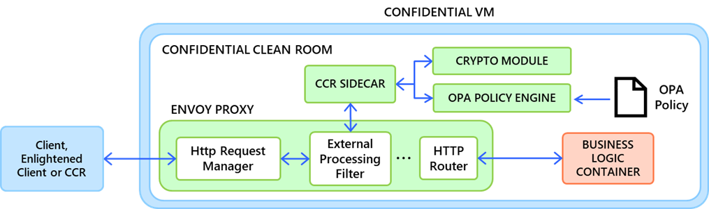
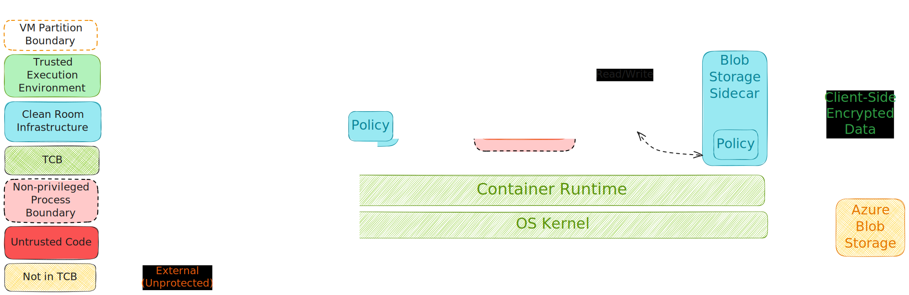

# High Level Design
<!--
This section captures high-level design of Azure Clean Room Infrastructure.
Audience: Engineering
Prerequisites: Architectural Overview
-->
An implementation of a Type 0 Azure Clean Room has been realized on top of Azure Confidential Container Instances (Confidential ACI).

## Overview

The Azure Clean Room implementation builds upon the Microsoft Research (Confidential Clean Room Services for DEPA) proposal to sandbox untrusted code using containers.

### DEPA

Figure *DEPA Confidential Clean Room Architecture (Confidential Clean Room Services for DEPA)*

DEPA Confidential Clean Rooms are a privacy preserving construct providing a secure, isolated execution environment where sensitive information from one or more data providers can be processed with security and privacy guarantees. The containerized reference implementation sets up a HTTP proxy using Envoy to enforce egress rules, and leverages Linux IP tables to achieve a sandbox that ensures all communications from the “untrusted” business logic container are intercepted by this proxy and inspected by a policy engine.

### Canonical Clean Room

Figure *Type 0 Azure Clean Room using Confidential ACI (Canonical)*

This content has been moved [here](../public/high_level_design.md).

This implementation of the Clean Room meets the functional requirements well, while providing high levels of flexibility/extensibility in terms of adding support for a large variety of data sources. However, there are concerns about the security of this model and servicing the same.

### Security Considerations

The usage of process isolation as the isolation boundary for the code sandbox makes the system vulnerable to the following chain of events:

1. A user container executing with user/non-root privileges can exploit a bug in the container runtime/kernel and elevate its privilege.
1. Once elevated, the user container can tamper with/circumvent the firewall and perform operations that would otherwise require root privileges.

“Elevation of Privilege” bugs within UVM Linux are no longer considered a security incident, and current Cloud security guidelines operate with the VM boundary as the basic block for a security perimeter. So, the complete VM is considered hostile from the perspective of the hypervisor, host OS, other VMs and the rest of the Cloud infrastructure, making any internal attacks within the VM noncritical. This implies that any changes required in the OS code to address any known/newly discovered vulnerabilities would need to come as part of the regular bug fix process, and these are further likely to be categorized low priority within that process by the community given the general direction of relegating security guarantees to the VM boundary.

This inability to offer a support statement or provide any security guarantees around the code sandbox effectively rules out a Canonical Clean Room using process isolation, as customers are now required to establish an external trust in the “untrusted” application that it will not attempt to break out of the sandbox.

### Custom Runtime Clean Room

Instead, a specialized clean room executing a custom runtime is used to enable the subset of customers/scenarios where a “trusted” runtime exists and can explicitly be trusted by the customers to not be malicious.

While this requirement places a little more burden on customers in comparison to a Canonical Clean Room, it provides value to the customers by retaining almost all the benefits of the clean room infrastructure discussed earlier in the document.

This content has been moved [here](../public/high_level_design.md).

## Frequently Asked Questions

### If the Type 0 sandbox expects the “custom runtime” to be trusted, then why bother with a Clean Room at all? Why not just use C-ACI?

A “Clean Room” is a way of configuring confidential computation, not an alternative mechanism. As discussed above in “Translating intent to a confidential computation configuration”, configuring C-ACI to operate as a clean room requires careful configuration and customers have a steep learning curve outside their core business domain. While the security considerations of the Type 0 Azure Clean Room require us to enforce an external trust on code in the sandbox, specifying this trust is a relatively trivial burden for the customer as compared to the rest of configuration.

This holds true for all custom runtime sandbox use cases, Type 0 or otherwise.

### Is a Type 0 Clean Room a placeholder, or long-term offering?

Apart from the advantage of having a clear path to production, a Type 0 Azure Clean Room remains a useful long-term offering as it appears to have a reasonable addressable market and is not just an initial/placeholder v1 offering.

The VMPL and VM isolation models provide a more secure code sandbox, but this security comes at a performance cost as data needs to flow across OS/kernel boundaries/address spaces. Any customer scenario with an externally trusted custom runtime such as single tenant lift and shift applications and 1P integrations are very likely to keep opting for a Type 0 Clean Room to avoid this performance penalty even after the alternative models become available.
