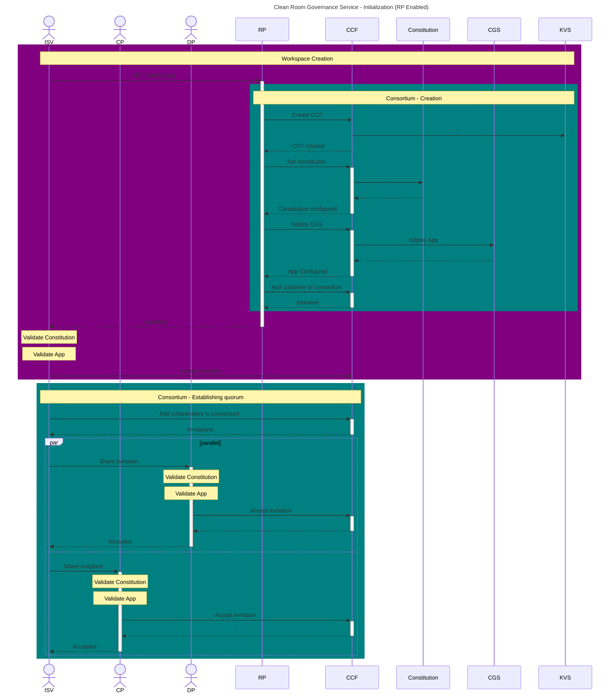
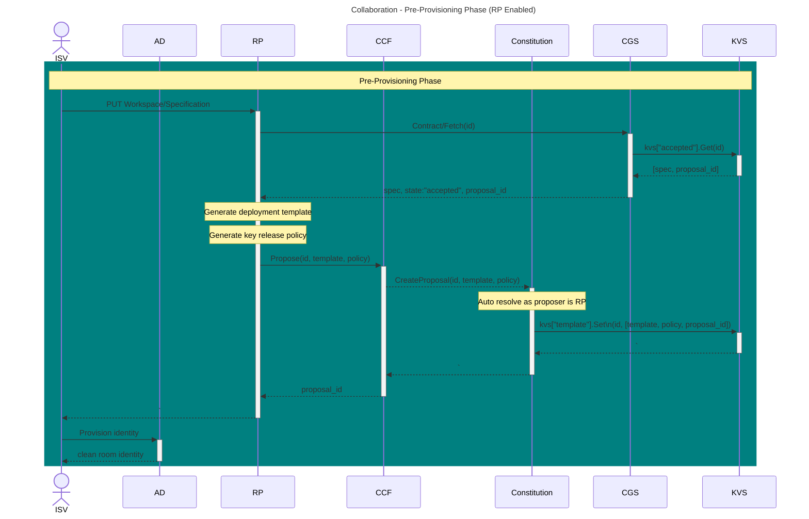
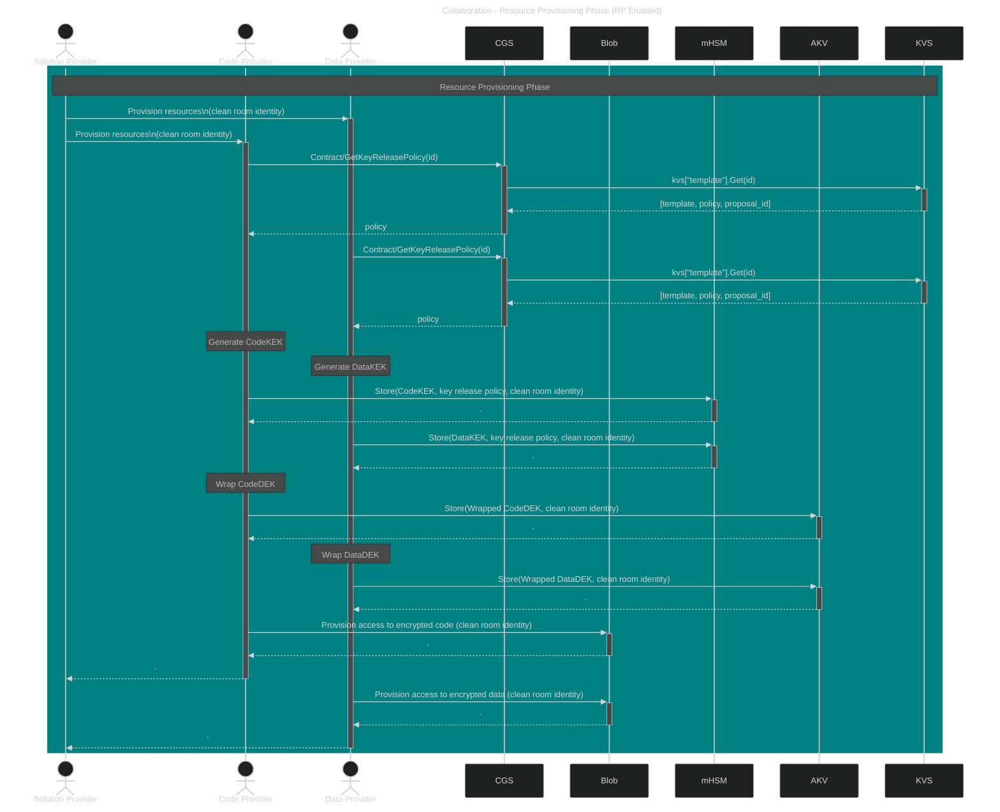

# Value-Add RP

A general-purpose RP is not useful for deploying a Clean Room or translating a Clean Room specification into its corresponding confidential computation deployment template as discussed earlier. Similarly, a general-purpose RP is not useful for creating and managing a multi-tenant contract or governance service as discussed here.

However, a case can be made for a Clean Room RP providing customer value-add in the context of multi-party collaboration workflows, as a few aspects of the Preparation Stage lend themselves well for offloading to a Microsoft RP without compromising on zero-trust requirements through verifiable trust.

## Clean Room Governance Service Initialization

A Clean Room RP can deploy and manage the Clean Room Governance Service (CGS) as an mCCF application in a managed RG within the customer tenant. The CCF infrastructure, constitution and the CGS application are all open-sourced, and customers can readily validate that only the expected code is running before joining the consortium and participating in the collaboration. This allows for a mechanism where the entry barrier for customers to learn CCF is greatly lowered, while still providing a fully auditable and verifiable option for advanced customers without bringing the RP into the TCB.

Figure _RP Enabled Clean Room Governance Service Initialization_

## Pre-Provisioning Phase

The Clean Room RP translates a CGS backed Clean Room Specification into the corresponding deployment template and key release policies which are then proposed to the mCCF instance as “attachments” to the given specification. The template and key release policy are necessarily equivalent to those generated by executing the open-sourced Clean Room tooling. This allows for a mechanism where customers can directly consume the deployment template and key release policy proposed by the RP, while still providing a fully verifiable option for advanced customers without bringing the RP into the TCB.

Figure RP Enabled Pre-Provisioning

## Resource Provision Phase

As part of the resource provision phase, data and code providers need to verify that the key release policy given by the solution provider corresponds to the agreed upon specification by executing the open-sourced Clean Room tooling again by themselves and comparing the two policies.
When the Clean Room RP proposes a key release policy to the mCCF as an “attachment” to the given specification, it allows for a mechanism where data and code providers can directly consume the key release policy proposed by the RP, while still providing a fully verifiable option for advanced customers without bringing the RP into the TCB.

Figure _RP Enabled Resource Provisioning*
