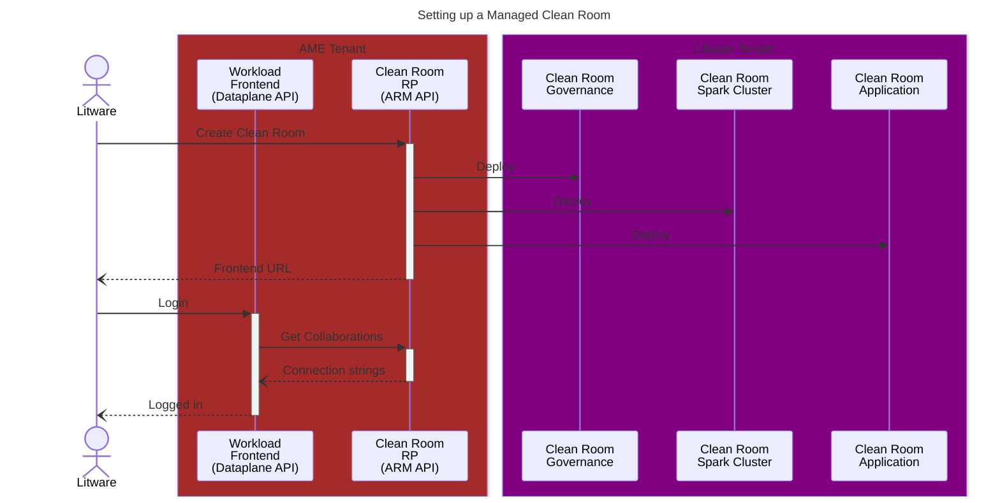
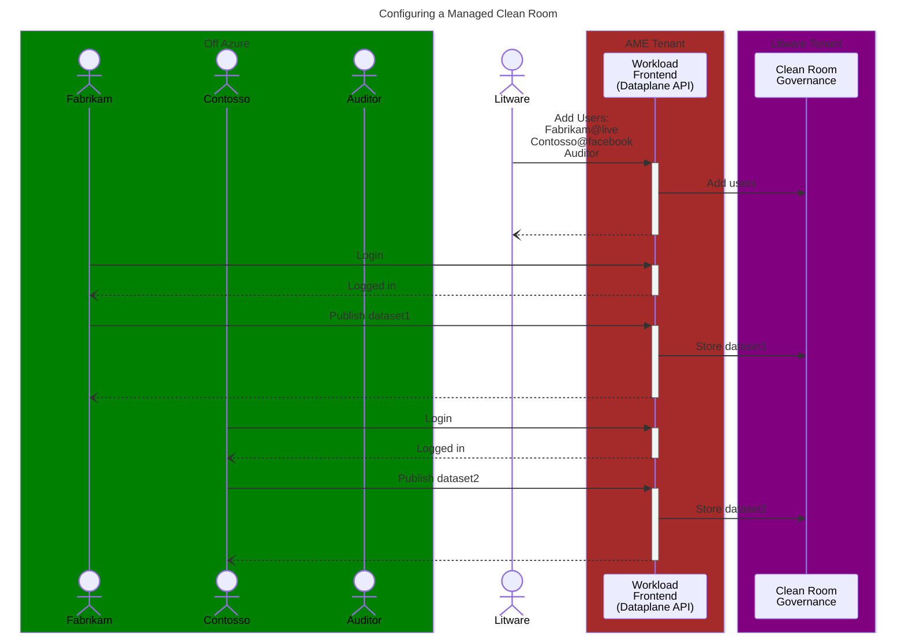
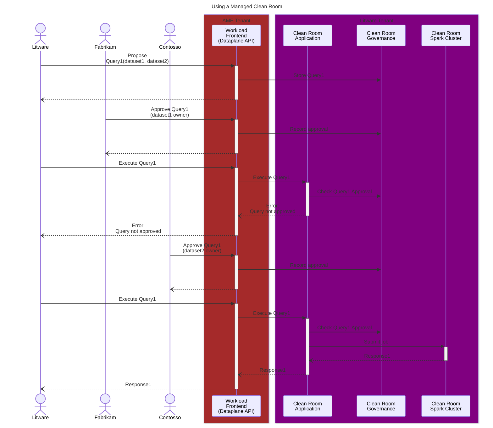
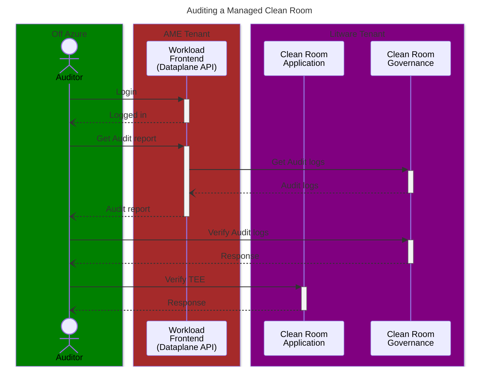

# Managed Clean Room Flow Diagrams

## Collaborator Flows

### Setting up a Managed Clean Room

### Configuring a Managed Clean Room

### Using a Managed Clean Room

### Auditing a Managed Clean Room

