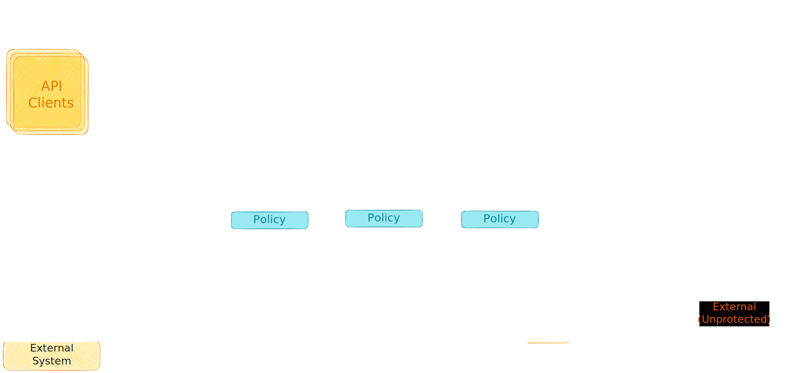

# Architecture
<!--
  This section captures the overall architecture of a Clean Room.
-->
<!--TODO: Add links to all the offerings/technologies mentioned in this file.-->

A Clean Room is a verifiable computation construct to process sensitive data. It hosts customer
applications requiring data protection within a standardized privacy preserving infrastructure.
The infrastructure takes on the responsibility of ensuring that the customers’ data is not
accessible outside the confidential TEE while treating the customers’ application as
opaque/untrusted code and executes the same within a sandbox enforcing the desired protection.

Figure - _Canonical representation of a Clean Room_

A canonical Clean Room provides a built-in mechanism for:

- executing opaque/untrusted code within a “code sandbox”,
- ensuring any data flowing out of this sandbox flows through a “data protection firewall”
  preventing any exfiltration.

## Code Sandbox

The code sandbox provides an isolation boundary between the customer application and the Clean Room
infrastructure, preventing any potentially faulty/malicious code from performing unauthorized
operations or IO.

## Data Protection Firewall

The data protection firewall is responsible for securely accessing sensitive data from the backing
data stores.

This functionality is provided to the customers’ application by surfacing hardened endpoints for
accessing the data securely. The mechanism used by such an endpoint to secure the data will depend
upon the _structure of the data_ being secured, and the _application layer protocol_ being used to
send this data to the backing data store.

E.g.,

- if the application is consuming a data store as a block device, the corresponding data source
endpoint can surface the data directly as a raw volume mapped into the sandbox and decrypt/encrypt
at a block level.
- if the application is consuming a data store as a file container,
the corresponding data source endpoint can surface the backing file container as a local volume
mapped into the sandbox, and the items within the file container as files that are
decrypted/encrypted at a file level.
- if the application is consuming a data store as a relational database, the corresponding
data source endpoint can surface a local proxy into the sandbox that executes user specified
queries to enforce egress rules at a row/column level.

Given the diverse and ever-expanding range of data stores, structure of the data being stored on
these data stores and the underlying protocols used for communication, a standardized access
mechanism would be difficult to achieve and sustain. Instead, an extensible architecture is
required for developing such mechanisms and plugging them into the data protection firewall,
allowing the applications to communicate with the endpoints directly in the native protocol for the
data source.

To achieve this, the data protection firewall is modelled using a collection of data source specific
extensions called privacy proxies, that extend the infrastructure to provide the desired
functionality.

The infrastructure natively provides hooks for surfacing local volumes into the sandbox, and this
can be used by extensions modelling data source as block devices or as a container of items. All
other models for consuming data will come through the network and are surfaced into the sandbox as
a network port.

## Privacy Proxy

Privacy proxies’ surface hardened endpoints for the backing data store inside the Clean Room.

From an application perspective, the proxy abstracts away nuances of confidential computing such as
privacy policy, client-side encryption and secure key release protocols. This allows the customer
application executing within the code-sandbox to remain agnostic to the privacy firewall and
communicate transparently with the backing datastore while accessing the data in clear.

From a data protection perspective, the proxies protect against data exfiltration by enforcing data
source protocol specific protection policy at the application layer. This protection comes in the
following flavours:

- A “secure” mode that encrypts all outbound data with a key that is only available inside a
  Clean Room environment. This mode effectively locks the data to a “closed loop” confidential
  network where any application consuming the data is also required to be executed within an
  environment that meets the secure key release policy requirements. Enforcing confidential
  computation requirements as part of the key release policy ensures that even if malicious actors
  obtain access to the data store, they will not be able to decrypt and consume the actual data
- A “trusted” mode that encrypts all outbound data with a mechanism enforcing customer specified
  external trust. This trust could come in multiple forms – TLS encrypted channel (HTTPS) with a
  trusted endpoint, or client-side encryption using a public key for which private key is securely
  accessed by other means, to state a couple. This mode enables a “trusted loop” network where
  customer applications running in a Clean Room can interoperate with applications executing in
  alternative trusted environments such as on-premises locations.
- A “open” mode that inspects all outbound data (responses/outbound calls) and enforces egress
  rules governing the type/content of data that is allowed to go out of the Clean Room. This enables
  customer applications operating as a gateway for sanitized data to interface with a zero-trust
  “open loop” partner/external network.

## Governance of a Clean Room

Clean Room infrastructure natively provides extensibility hooks for invocation of user specified external service endpoints (trusted) to enable governance flows like runtime validation of consent for executing the application or presenting data, generation of an audit trail for all privileged operations performed inside the clean room, and confidential telemetry for any troubleshooting.
