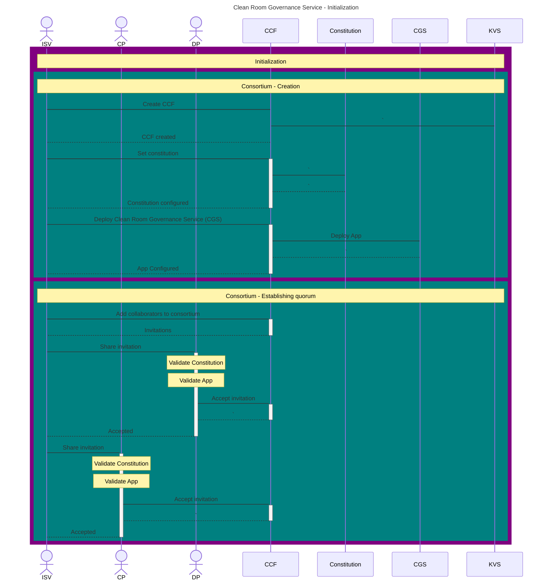
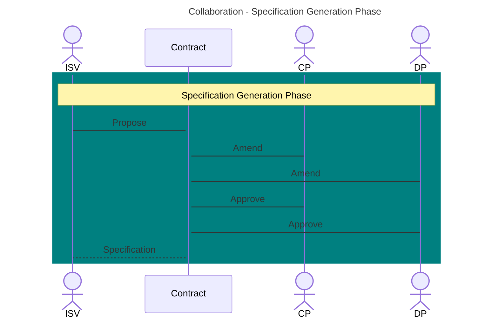
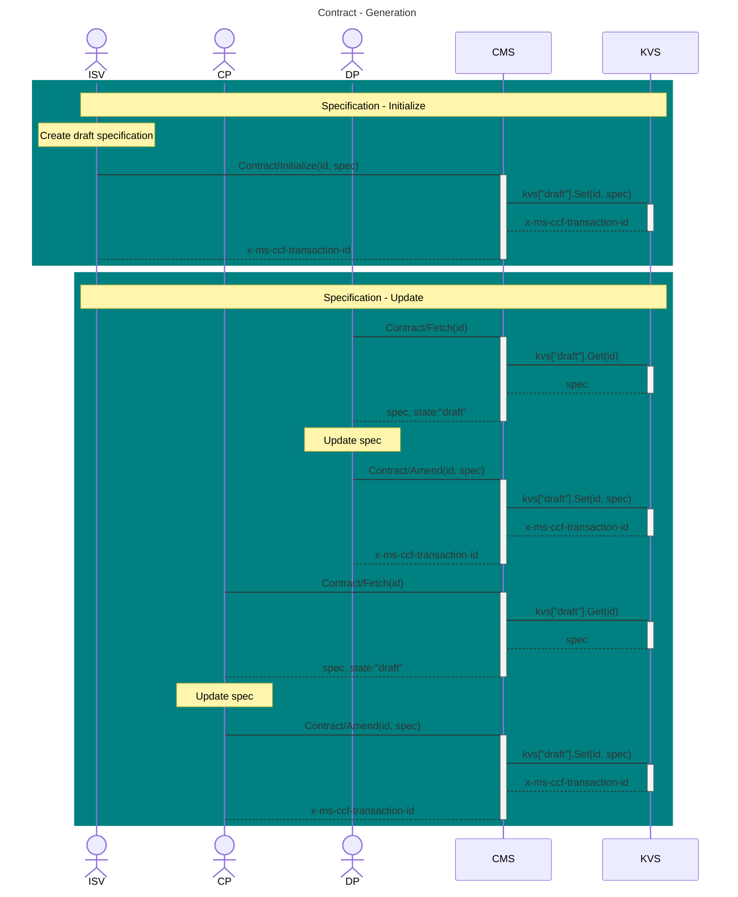
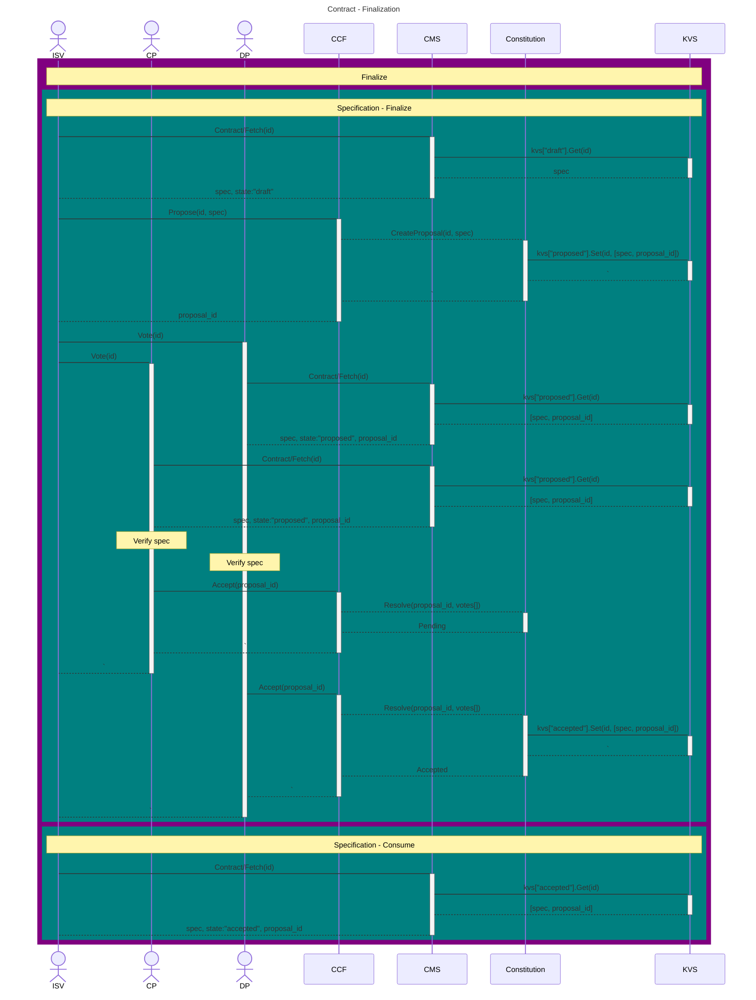
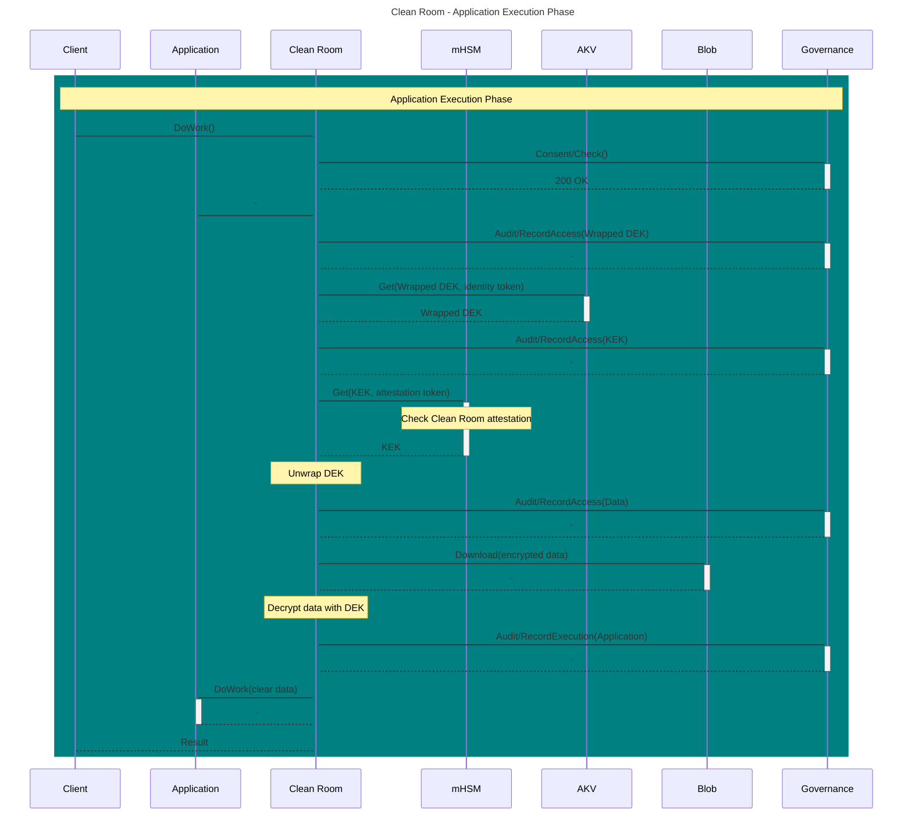

# Clean Room Governance Service
<!-- Audience: Engineering
Prerequisites: Architectural Overview, User Flow -->

Azure Clean Rooms lend themselves well to zero-trust multi-party collaboration on Azure. The Clean Room specification can be used to capture the mutually agreed upon data protection requirements for the collaboration, and the Clean Room tooling can be used to translate this intent into a hardened confidential computation specification. However, from an end-to-end workflow perspective, a mechanism is needed for the collaborators to come together in Azure and co-author the clean room specification before deployment or co-govern the clean room instance after deployment in a tamper proof and auditable manner that meets the zero-trust bar.

Clean Room Governance Service (CGS), a per-collaboration open-sourced application deployed by one of the collaborators in a zero-trust confidential computing environment serves as a confidentially attestable source of truth, exposing secure API for contract management as well as governance.

Modelling this Clean Room Governance Service (CGS) as a Confidential Consortium Framework (CCF) application meets the requirements particularly well. CCF is an open-source framework for building stateful services providing decentralized trust. It enables multiple parties to execute auditable code over confidential data without trusting each other or a privileged operator. CCF provides robust guarantees on transparent governance (consortium), application integrity (hardware-backed integrity for application logic and data) and confidentiality (all transactions are confidential by default). All CCF transactions are reflected in a tamper-proof ledger that can be used to audit governance as well as obtain transaction receipts to verify the consistency of the service and prove the execution of transaction.

## Initialization

Figure *Initializing the Clean Room Governance Service*

The solution provider deploys CGS as a CCF application, where the constitution of the CCF will restrict modifications to the CGS application and the constitution itself. The solution provider subsequently invites all the collaborators to join the consortium.

## Contract Management & Specification Generation Flow

The per-collaboration (Clean Room Governance Service) can readily serve as a secure & attested source of truth for the current state of a shared “contract”, by exposing Contract API for the collaborators to propose, amend and accept contracts and any related assets. This offers a robust mechanism for the generation and acceptance of a collaboration contract represented as a Clean Room specification (Specification Generation Phase).

Figure *Specification generation flow*

### Co-authoring the collaboration contract

Figure *Contract management using Clean Room Governance Service (co-authoring the contract)*

The solution provider initializes a draft clean room specification using the Contract API of CGS. Thereafter, the collaborators iterate over the draft specification and make changes to the data sources and applications to be executed within the Clean Room.

### Finalizing the collaboration contract

Figure *Contract management using Clean Room Governance Service (finalizing the contract)*

Once the collaborators have completed iterating over the specification, the solution provider proposes a “contract” to the CCF containing the agreed upon Clean Room specification. Each collaborator reviews this proposal and verifies that the specification enforces their requirements before accepting the proposal. Once all the collaborators have accepted the proposal, the “contract” is moved to an accepted state and the specification is finalized.

## Deployment template and clean room policy management

Once the “contract” specification has been finalized the solution provider now generates a deployment template and the clean room policy as referred to in the  Pre-Provisioning Phase. The solution provider then proposes this deployment template and policy as the “deployment spec” and “clean room policy” proposals to the CCF that is containing the agreed upon Clean Room specification. Each collaborator reviews these proposals and verifies that the deployment spec and policy correspond to the agreed upon Clean Room specification before accepting the proposals. Once all the collaborators have accepted the proposals, the “deployment spec” and “policy” becomes final. Once finalized these can be used for both resource provisioning and compute provisioning as per the Resource Provisioning Phase and Compute Provisioning Phase.

## Cross tenant identity provisioning

One of the aspects mentioned in the Resource Provisioning Phase is providing a mechanism for enabling access to resources for a cross tenant clean room identity. The Clean Room Governance Service can act as an Identity provider (IdP)/OIDC issuer and one can leverage federated identity credential with external identity provider to create a trust relationship between a user-assigned managed identity in a tenant and CGS as the external identity provider. Thus, each collaborator sets up a user-assigned managed identity in their tenant and configures Federated Credential on that identity, with the issuer URL pointing to an endpoint that exposes the CGS OpenID configuration and token signing keys. Then as part of the Application Execution Phase the clean room instance requests an ID token from CGS. CGS first confirms that the clean room presents a valid attestation report with expected values (as per the agreed upon clean room policy proposal) and on success returns an ID Token. The clean room instance uses the ID token to get access tokens for each of the managed identities in respective tenants.

## Governance Flow

The per-collaboration (Clean Room Governance Service) can readily serve as a secure & attested endpoint satisfying the Governance Considerations discussed earlier. The endpoint is responsible for maintaining tamper proof consent and audit ledger for the Clean Room and is invoked by the Clean Room infrastructure during the application execution phase to meet various governance requirements.

Figure 6 5 Governance flow in Application Execution Phase
<!-- TODO: Add high level flow for the CGS implementation of Consent API & Audit API using CCF infrastructure. -->
